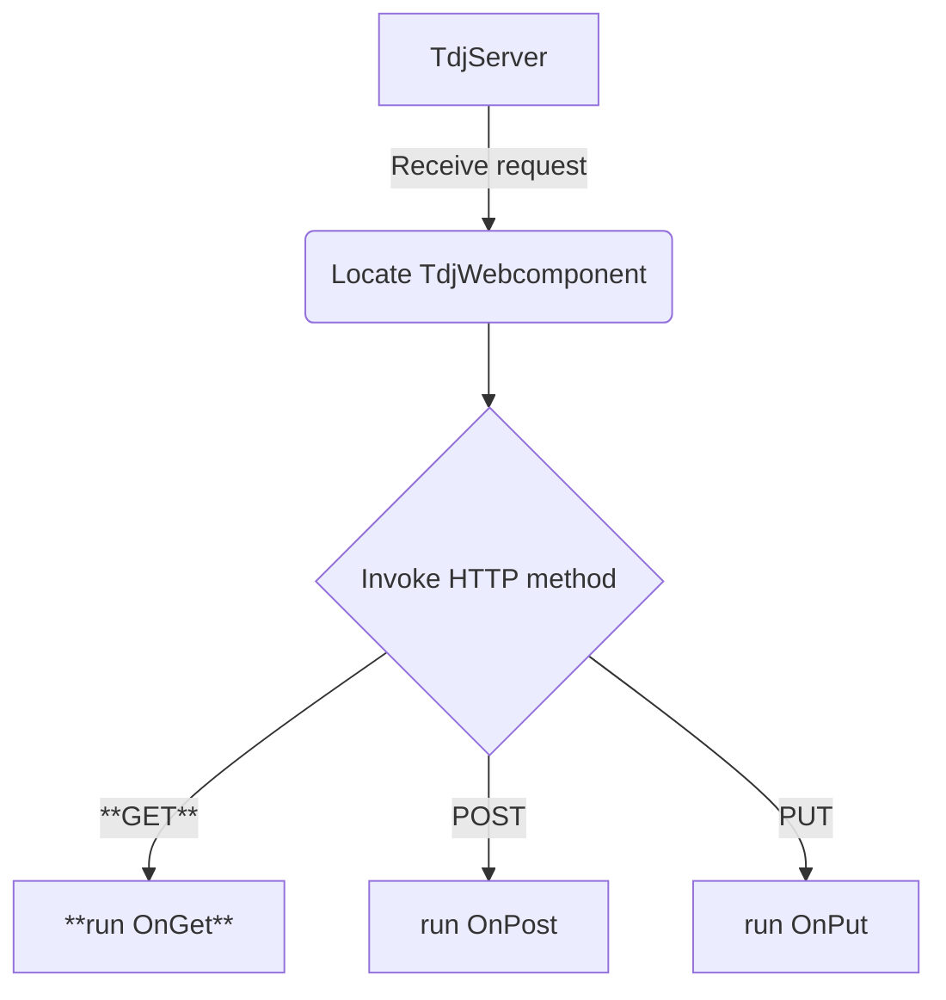

[](http://www.gnu.org/licenses/agpl-3.0)


[](https://github.com/michaelJustin/daraja-framework/actions/workflows/doxygen.yml)
[](https://github.com/michaelJustin/daraja-framework/actions/workflows/pages/pages-build-deployment)


⭐ Star us on GitHub — it motivates us a lot!


In short, Daraja enables Object Pascal developers to write *well-structured HTTP server applications*.

## About

__Daraja__ is a compact and flexible HTTP server application framework for Object Pascal, based on the HTTP server included in [Indy - Internet Direct](https://github.com/IndySockets/Indy). The framework uses URL patterns to match requests to your resource handler code, and optional request filtering for pre- and post-processing. It enables developers to create well-structured HTTP server applications, written with 100% open source code.

## Usage

<details>
<summary>Prerequisites</summary>

The minimum requirements are:

 - Delphi 2009 or higher _or_
 - Lazarus 3.x / Free Pascal 3.2.x
 - [Indy - Internet Direct](https://github.com/IndySockets/Indy) 10.6.2 or 10.6.3

  Optional requirements for some code examples and logging:
 - [JsonDataObjects](https://github.com/ahausladen/JsonDataObjects)
 - [Log4D](http://sourceforge.net/projects/log4d/)
  
</details>

<details>
<summary>IDE configuration guide</summary>

To make Daraja HTTP Framework and Internet Direct (Indy) available for a project,

 - add the Daraja HTTP Framework `<Install>/source` folder to the project search path
 - add the folders `<Indy>/Lib/Core`, `<Indy>/Lib/System` and `<Indy>/Lib/Protocols` to
the project search path
 
</details>

## Example

These are the basic steps to configure a simple "Hello, World!" application. A simple resource will be defined in a TdjWebComponent which has only one method, `OnGet`. The web component the will be installed in the server.

### Resource definition

A Daraja Web Component defines the request handling and response building, but it does not specify the actual location (HTTP address) of a resource.
The web component in this example handles HTTP GET requests by overriding the OnGet method. The method sets the response content text and content type.

https://github.com/michaelJustin/daraja-framework/blob/a047517ead8faad3c30f5096c090863bbd36e92e/demo/01_helloworld/MainUnit.pas#L40-L50

### Context and resource registration

We want to place the web component in the context `tutorial` and the absolute path `/hello`. We also want to use port 80. 
The full URL of our resource is `http://127.0.0.1/tutorial/hello`

https://github.com/michaelJustin/daraja-framework/blob/a047517ead8faad3c30f5096c090863bbd36e92e/demo/01_helloworld/MainUnit.pas#L57-L68

#### Test with curl:

```Console
curl -i http://127.0.0.1/tutorial/hello
HTTP/1.1 200 OK
Connection: keep-alive
Content-Type: text/plain; charset=ISO-8859-1
Content-Length: 13
Date: Wed, 22 Jan 2025 19:07:14 GMT

Hello, World!
```

<details>
<summary>Flowchart diagram</summary>
 


</details>

## Documentation

### API docs

https://michaeljustin.github.io/daraja-framework/

### Getting started with Daraja

https://www.habarisoft.com/daraja_framework/3.0.4/docs/DarajaFrameworkGettingStarted.pdf

## Licensing

Daraja HTTP Framework is dual licensed under the GNU Affero General Public License and a commercial license. The GNU Affero General Public License is a free, copyleft license for software and other kinds of works, specifically designed to ensure cooperation with the community in the case of network server software.

### AGPL licensing FAQ

<details>
<summary>Can I use it in my commercial Project?</summary>
Yes, if you open source your whole project (thus also AGPL it) otherwise no.
</details>

<details>
<summary>Is it enough to ship the licence texts or do I need to ship the source code (from Daraja) too?</summary>
You have to supply the whole sourcecode of everything - but a download link should suffice.
</details>

<details>
<summary>Do I need to mention the use of Daraja inside my program (like a info message or something)?</summary>
No.
</details>

### Commercial license

You can be released from the requirements of the AGPL license by purchasing a commercial license. The commercial license can be obtained from https://www.habarisoft.com/daraja_framework.html

## Credits

This software uses the following open source packages:

- [Indy - Internet Direct](https://github.com/IndySockets/Indy)

For example code, unit testing, and documentation, it uses the following open source packages:

- [JsonDataObjects](https://github.com/ahausladen/JsonDataObjects) for example code
- [Log4D](http://sourceforge.net/projects/log4d/) for logging
- [DUnit](https://dunit.sourceforge.net/) and [FPCUnit](https://wiki.freepascal.org/fpcunit) for unit testing
- [Doxygen](https://www.doxygen.nl/) Doxygen is a widely-used documentation generator tool in software development
- [pas2dox](http://pas2dox.sourceforge.net) Pas2dox is a pre-processor addon for the Doxygen documentation generator.

## Origins

> "Daraja" means "bridge" in Swahili. The Daraja Framework serves as a bridge between incoming HTTP requests and the Object Pascal code that handles them, enabling seamless integration between web traffic and application logic.
> — ChatGPT, OpenAI (May 2025)
